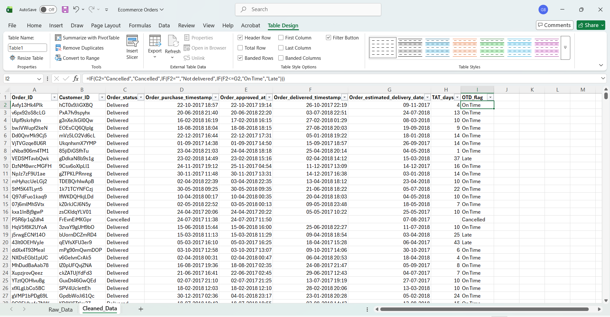
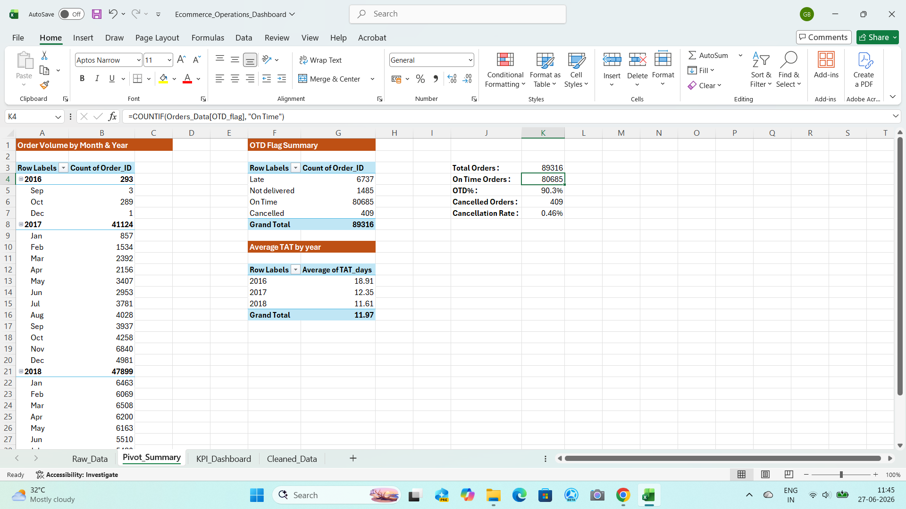
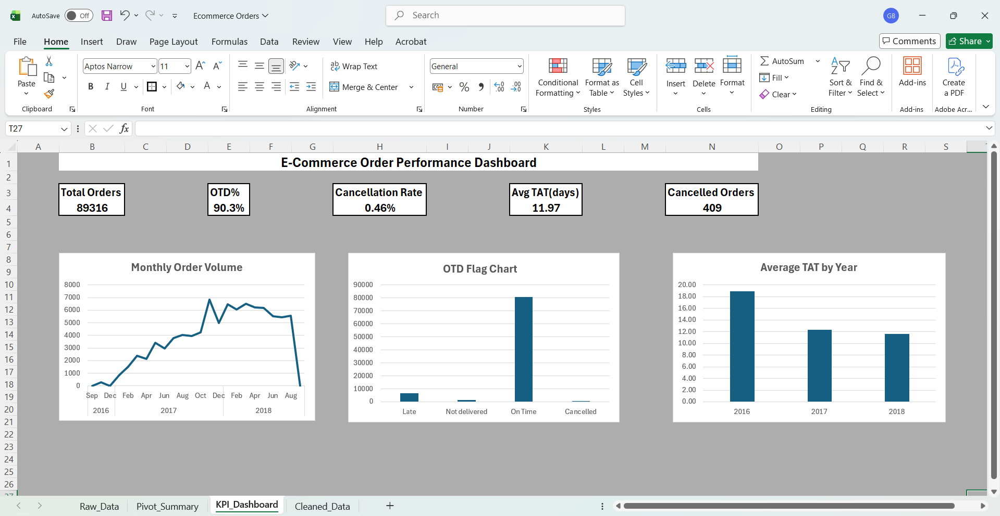

# E-Commerce Operations Dashboard (Excel)

## Project Overview
Analysis of 89,316 orders from the Ecommerce Order & Supply Chain Dataset (Kaggle) to track key operational KPIs using Microsoft Excel.

Built as part of my transition into Operations Analytics.

---

## Key KPIs

| Metric | Value |
|--------|-------|
| Total Orders | 89,316 |
| OTD% | 90.3% |
| Avg TAT | 11.97 days |
| Cancelled Orders | 409 |
| Cancellation Rate | 0.46% |

---

## Key Insights
- Order volume grew from 293 orders (2016) to 47,899 orders (2018)
- Delivery speed improved year on year: 18.91 days (2016) → 12.35 days (2017) → 11.61 days (2018)
- 90.3% of delivered orders were On Time
- Cancellation rate was very low at 0.46%

---

## Skills Demonstrated
- Data Cleaning: TRIM, PROPER, IF
- Calculated Columns: TAT (days), OTD Flag
- Formulas: COUNTIF, AVERAGEIF, nested IF
- PivotTables & PivotCharts
- KPI Dashboard design in Excel

---

## Project Walkthrough

### Step 1 — Data Cleaning
Applied TRIM on Order ID and Customer ID. Used PROPER on Order Status. Added TAT_days and OTD_flag calculated columns using nested IF formulas.

### Step 2 — Pivot Summary & KPI Calculations
Built three PivotTables: Monthly Order Volume, OTD Flag Summary, Average TAT by Year. Calculated OTD% and Cancellation Rate using COUNTIF and COUNTA formulas.

### Step 3 — KPI Dashboard
Complete dashboard with 5 KPI cards and 3 charts — Monthly Order Volume (line chart), OTD Flag Breakdown (column chart), Average TAT by Year (column chart).

---

## Dataset
Source: [Ecommerce Order & Supply Chain Dataset — Kaggle](https://www.kaggle.com/datasets/bytadit/ecommerce-order-dataset)

---

## Tools Used
- Microsoft Excel (PivotTables, PivotCharts, Formulas, Dashboard Design)

---

## Files
- [Ecommerce_Operations_Dashboard.xlsx](Ecommerce_Operations_Dashboard.xlsx)

---

*Built by Gargi Barman | Aspiring Operations Analyst*
